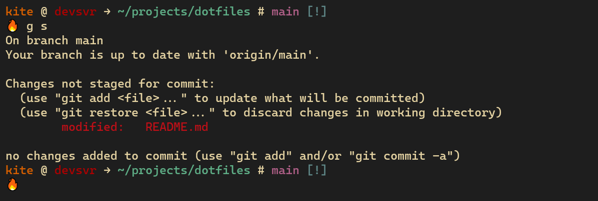

# Kalyan's dotfiles
My simple and personal terminal related customizations...



## Setup
```
./setup.sh [-f | --force]
```

**Note:** Please restrain yourself from blindly using my setup script and consider picking-up parts of my dotfiles as deemed required.

## My Thoughts
There are a lot more configurations and customizations available in many dotfiles repositories over github and in the internet. But still writing our own configurations and customizations will help us assess what is required and what is not and finally, tune them to our very own needs.

Also, as a Cybersecurity enthusiast, running some random code of the internet still haunts me in the night for not knowing it completely like what are all the things that it does than writing my own.

But I still need to look for inspirations as I'm not an expert in this and I'm still learning. So, please find my inspirators below and I sincerely thank them for making their code available for public.

## Inspirations
@[Mathias Bynens](https://github.com/mathiasbynens) - [dotfiles](https://github.com/mathiasbynens/dotfiles) repository. \
@[amix](https://github.com/amix) - [vimrc](https://github.com/amix/vimrc) settings. \
and many other articles of the internet, etc.
